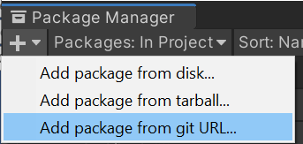
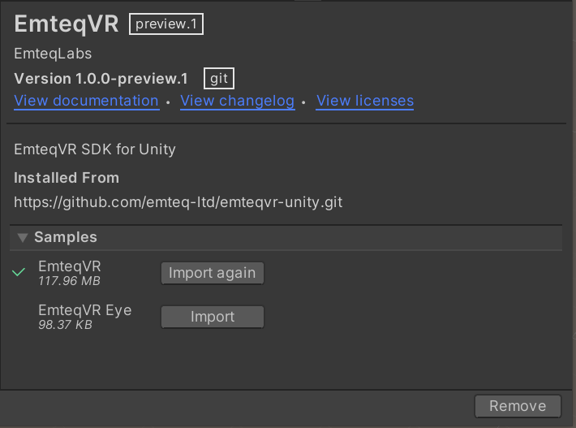

# EmteqVR SDK for Unity


This is the stable EmteqVR SDK for Unity. It provides APIs to access biometric data from EmteqVR sensors as well as demos with examples of API usage.

### Installation

#### Through the package manager



Open the package manager, click the + icon, and add git url.

```
https://github.com/emteq-ltd/emteqvr-unity.git
```

### Samples

Once the package has been imported, you must also import the EmteqVR Sample scenes to access the demos and the EmteqVRManager prefab.



### Usage

In order for the EmteqVR SDK to function, you will need to add `EmteqVRManager` prefab on to the main scene of your project.  


### API Documentation

Please check our [Wiki page](https://github.com/emteq-ltd/emteqvr-unity/wiki) for API docs and our manual.
